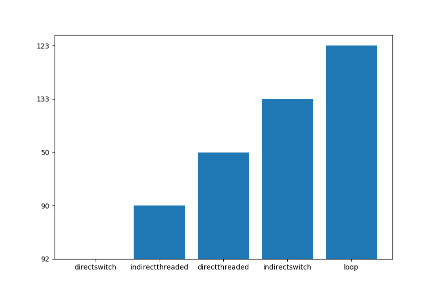

# Interpreters
Code for the interpreter implementation strategies article (https://faouellet.github.io/interpreter/)

To run the benchmarks on your computer, you can simply run the following command:
```bash
python benchmarks.py
```
This will compile the C++ files and run the output as to produce a figure such as this one:

